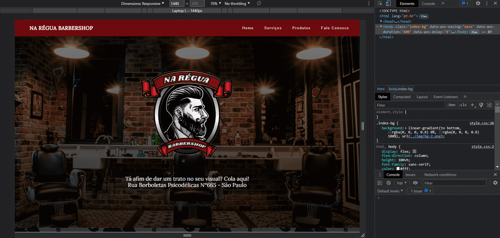
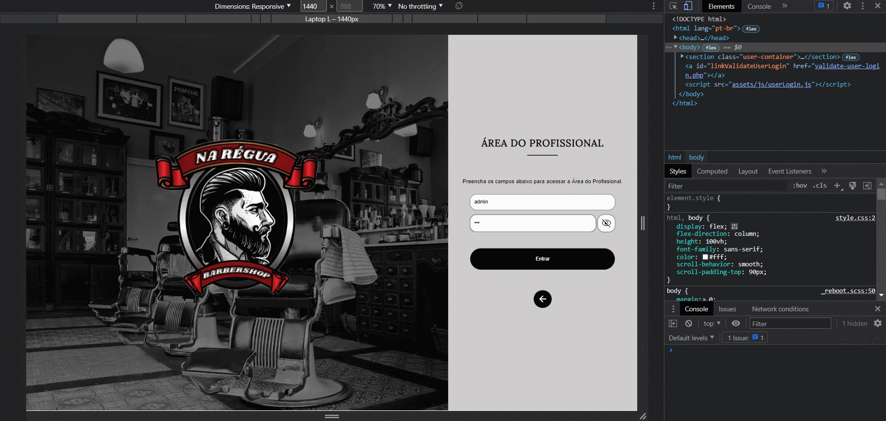
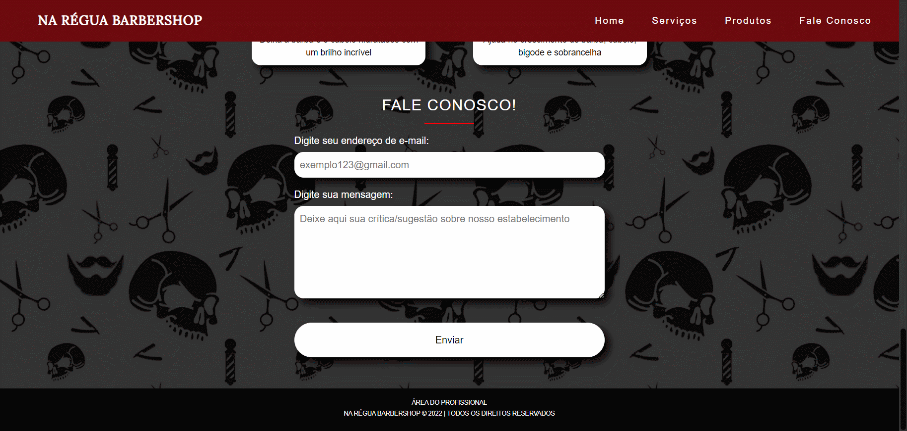

<h1> <strong>Na Régua Barbershop</strong></h1>

**Na Régua Barbershop** é um site de uma barbearia fictícia. Na página principal é apresentado ao usuário sobre a barbearia, lá podemos ver seus serviços, produtos e uma área onde os usuários podem enviar uma mensagem ao estabelecimento. Ao acessar a área do profissional através de um login, o administrador da barbearia pode **visualizar, inserir, excluir ou alterar** os dados sobre seus serviços, produtos e clientes, além de ter acesso as mensagens que os usuários o enviam através da página principal.

 

## **Tecnologias utilizadas**

 

  
 
   

  
 

   

 

## **Ferramentas utilizadas**

 

 

## **Design do sistema**

 

 - **Página principal:**

  

 - **Página de login:**

  

- **Páginas da área do profissional:**

   

 - **Responsividade na página principal:**

   

 - **Responsividade na página de login e na página da área do profissional:**

  

## **Funcionalidades do sistema**

 

 - **Inserção de dados:**

  

- **Alteração de dados:**

  

- **Exclusão de dados:**

  

- **Validação de formulários:**

Os formulários possuem validações para evitar que haja inserção ou alteração de um dado errado, como por exemplo, evitar que um campo vazio seja enviado ao banco de dados, ou também verificar se um endereço de e-mail é válido ou não, por exemplo.

 

 

  

## **Hospedagem do sistema**

Caso você queira visualizar melhor esse projeto em seu navegador, acesse o link abaixo:

- [Na Régua Barbershop](http://nareguabarbershop.atwebpages.com/)
