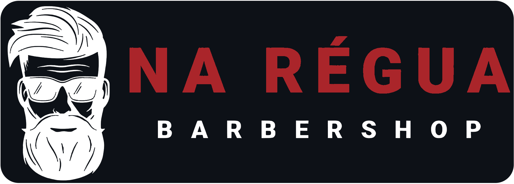
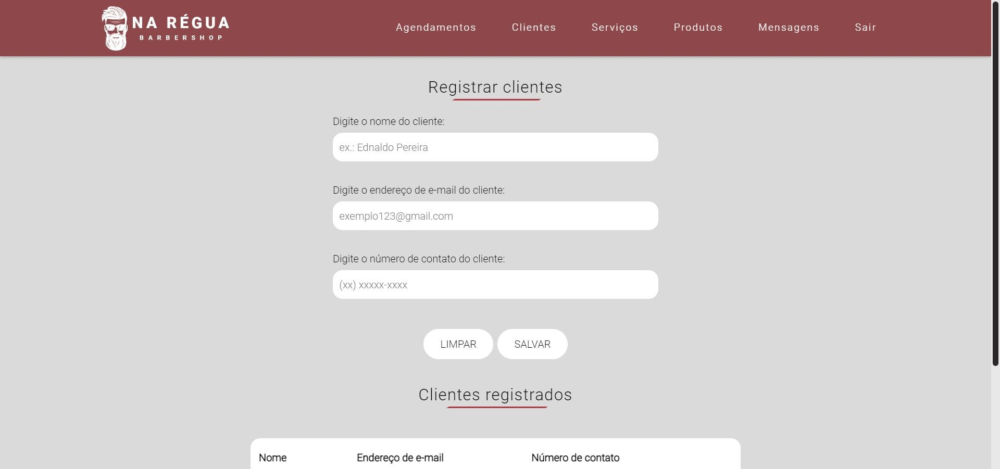
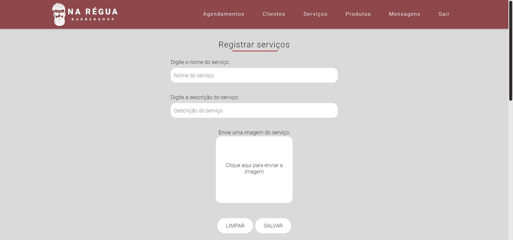
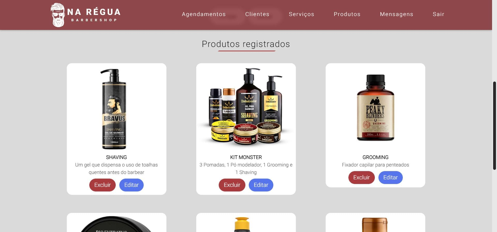
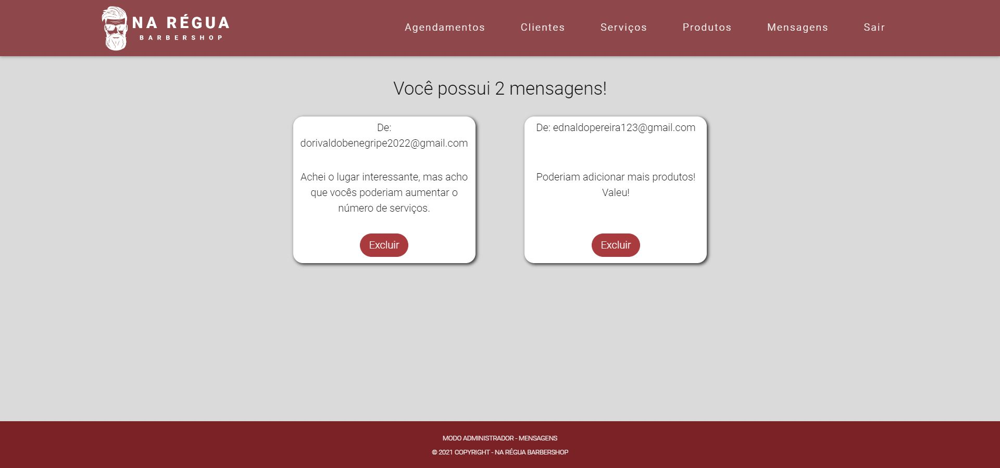

 

**Na Régua Barbershop** é um sistema web responsivo de uma barbearia fictícia. Na página principal é apresentado aos usuários sobre a barbearia, lá podemos ver seus serviços, produtos e uma área onde os usuários podem enviar uma mensagem ao estabelecimento. Ao acessar a área do profissional através de um login, o administrador da barbearia pode **visualizar, inserir, excluir ou alterar** os dados sobre seus serviços, produtos e clientes, além de ter acesso as mensagens que os usuários o enviam através da página principal.

 

## 👨‍💻 Tecnologias utilizadas

 

  
 
   

   

 

## 🛠️ Ferramentas utilizadas

 

 

## 📷 Design do sistema

 

 - Página principal:

  

 - Tela de login do administrador:

  

- Algumas telas da área do administrador:

 

 

 

  

## ⚙ Funcionalidades do sistema

- Inserção de dados:

    É possível agendar clientes, registrar novos clientes, novos produtos e novos serviços.

 

- Alteração de dados:
  
    É possível fazer alterações nos agendamentos, clientes, produtos e serviços registrados.

 

- Exclusão de dados:

    É possível excluir os agendamentos, clientes, produtos, serviços e as mensagens de usuários que são enviadas ao administrador.

 

- Validações de formulários:

    Os formulários possuem validações para evitar que haja a inserção ou alteração de um dado errado, como por exemplo, evitar que um campo vazio seja enviado ao banco de dados, ou também verificar se um endereço de e-mail é válido ou não.

 

## 🔗 Link do sistema

▸ http://nareguabarbershop.atwebpages.com/